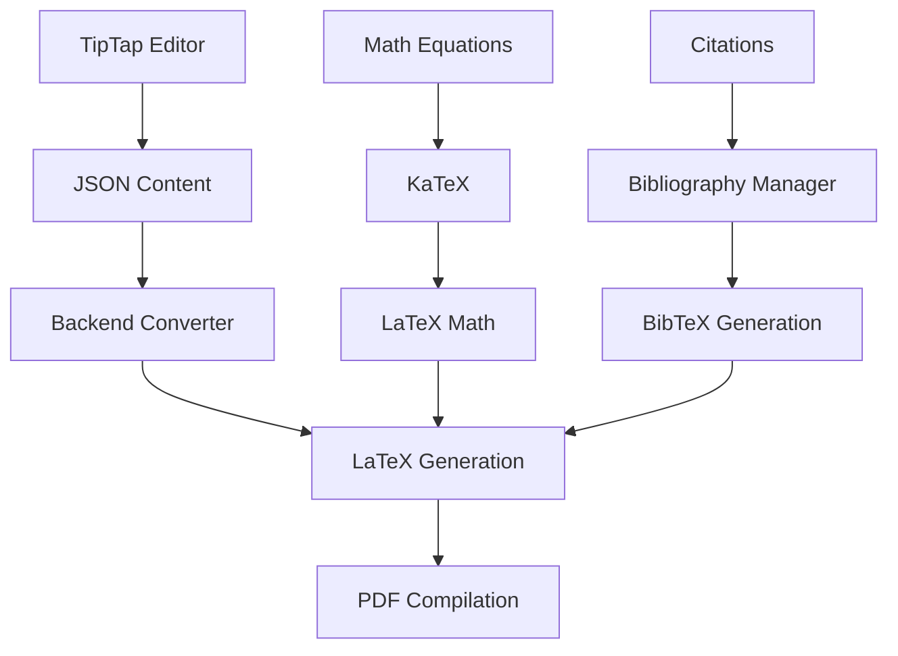

# Yazarlar Platformu - Tam Geliştirme Yol Haritası

## 🎯 Proje Vizyonu

**Modern, sürdürülebilir ve geliştirilebilir bir yazım platformu**: Edebi türlerden akademik yazıma kadar uzanan kapsamlı bir yazı deneyimi.

### Hedef Kullanıcılar
- **📚 Yazarlar & Edebiyat Severleri** (Phase 1)
- **🎓 Akademisyenler & Araştırmacılar** (Phase 2)
- **🏛️ Üniversiteler & Kurumlar** (Phase 3)

---

## 🏗️ Teknoloji Stack

### Frontend
- **Framework**: Next.js 14 (App Router) + JavaScript
- **Styling**: Tailwind CSS + shadcn/ui
- **State Management**: Zustand
- **API Client**: Tanstack Query (React Query)
- **Rich Text Editor**: **TipTap** (Seçilen çözüm)
- **Validation**: Zod

### Backend
- **Framework**: FastAPI + Python 3.13+
- **Database**: PostgreSQL 15+
- **ORM**: SQLAlchemy 2.0
- **Authentication**: JWT + FastAPI Security
- **Validation**: Pydantic

### Export & Academic Tools
- **LaTeX**: Server-side Pandoc integration
- **PDF Generation**: LaTeX compilation
- **Math Support**: KaTeX integration
- **Citations**: Custom citation management system

---

## 📊 Mevcut Durum (2025-01-25)

### ✅ TAMAMLANMIŞ - Backend (100% Operasyonel)
```
🚀 BACKEND API: Fully functional
├── ✅ FastAPI Server: Zero errors, production ready
├── ✅ Database: PostgreSQL + SQLAlchemy 2.0 + Migrations
├── ✅ Authentication: JWT + User management working
├── ✅ Article System: Complete CRUD + Business logic
├── ✅ Collection System: Series/Books management
├── ✅ Category System: Hierarchical categories
├── ✅ Repository Pattern: Clean data access layer
├── ✅ Service Layer: Business logic separation
├── ✅ API Endpoints: RESTful + Rate limiting
├── ✅ Security: Production-ready headers & validation
├── ✅ Error Handling: Structured error responses
└── ✅ Environment: Configuration management
```

### ✅ TAMAMLANMIŞ - Frontend Auth (Functional)
```
🎨 FRONTEND AUTH: Working
├── ✅ Next.js 14: App Router + Modern setup
├── ✅ Authentication: Login/Register/Profile pages
├── ✅ UI Framework: Tailwind + shadcn/ui components
├── ✅ State Management: Zustand auth store
└── ✅ API Integration: Auth endpoints connected
```

### 🎯 ŞU ANKI GÖREV: Article Creation System
```
🔄 ARTICLE SYSTEM FRONTEND: Starting now
├── ❌ Rich Text Editor: TipTap integration
├── ❌ Article Creation Form: Title, content, metadata
├── ❌ Category/Collection Selectors: Backend integration
├── ❌ Tag Management: Dynamic tag input
├── ❌ Status Management: Draft/Published workflow
├── ❌ Preview System: Real-time preview
├── ❌ Export System: LaTeX/PDF generation
└── ❌ Article Management Dashboard: Writer's interface
```

---

## 🎨 Rich Text Editor: TipTap Implementation

### Seçim Gerekçesi
**TipTap** en dengeli ve genişletilebilir seçenek:
- ✅ **Typography Control**: Perfect for literary content
- ✅ **Extensible Architecture**: Custom extensions support
- ✅ **Modern & Performant**: React optimized
- ✅ **Export Flexibility**: HTML, JSON, Markdown
- ✅ **Mathematical Support**: KaTeX integration ready

### Edebi Yazım Özellikleri
```javascript
const LiteraryFeatures = {
  typography: {
    fonts: ["Merriweather", "Lora", "Crimson Text"], // Serif fonts
    lineHeight: "adjustable",
    letterSpacing: "fine-tuning",
    textAlign: "justify support"
  },
  
  formatting: {
    poetry: "Verse/stanza structure support",
    dialogue: "Character dialogue formatting",
    footnotes: "Academic-style footnotes",
    quotes: "Pull-quotes + block-quotes",
    emphasis: "Multiple emphasis styles"
  },
  
  writing: {
    focusMode: "Distraction-free interface",
    darkMode: "Eye-comfort writing",
    wordCount: "Real-time statistics",
    readingTime: "Estimated reading time"
  }
}
```

### Custom Extensions Planı
```javascript
const CustomExtensions = [
  "PoeticStructure",      // Şiir formatları
  "DialogueFormatter",    // Diyalog düzenleme
  "FootnoteManager",      // Dipnot sistemi
  "CitationInline",       // Atıf sistemi
  "MathEquation",         // Matematik formülleri
  "WritingStats",         // Yazım istatistikleri
  "FocusMode",           // Odaklanma modu
  "AutoSave"             // Otomatik kaydetme
]
```

---

## 📄 LaTeX Export Sistemi

### Implementation Strategy


### Export Formats
```javascript
const ExportFormats = {
  immediate: {
    HTML: "Web publishing ready",
    Markdown: "Platform independent",
    JSON: "TipTap native format"
  },
  
  advanced: {
    LaTeX: "Academic standard",
    PDF: "Print ready (via LaTeX)",
    EPUB: "E-book format",
    DOCX: "Microsoft Word compatibility"
  },
  
  academic: {
    "IEEE Template": "Conference papers",
    "ACM Template": "Computer science journals",
    "APA Style": "Psychology/Education",
    "Turkish Thesis": "YÖK standards"
  }
}
```

### LaTeX Templates
```latex
% Edebi Metin Template
\documentclass[12pt,a4paper]{book}
\usepackage[utf8]{inputenc}
\usepackage[turkish]{babel}
\usepackage{poetry}
\usepackage{dialogue}
\usepackage{setspace}
\onehalfspacing

% Akademik Makale Template
\documentclass[12pt,a4paper]{article}
\usepackage[utf8]{inputenc}
\usepackage[turkish]{babel}
\usepackage{amsmath,amsfonts,amssymb}
\usepackage{cite}
\usepackage{graphicx}
\usepackage{hyperref}
```

---

## 🎓 Phase 2: Akademik Sistem Roadmap

### Akademik Özellikler
```javascript
const AcademicSystem = {
  documentTypes: {
    thesis: {
      types: ["Lisans", "Yüksek Lisans", "Doktora"],
      templates: ["İTÜ", "Boğaziçi", "ODTÜ", "İstanbul Üniversitesi"],
      features: [
        "Otomatik bölüm numaralandırma",
        "İçindekiler oluşturma",
        "Kaynakça entegrasyonu",
        "Şekil/Tablo yönetimi"
      ]
    },
    
    article: {
      journals: ["IEEE", "ACM", "Nature", "Turkish journals"],
      formatting: "Dergi özel formatları",
      submission: "Dergi submission hazırlığı",
      peerReview: "Hakemlik süreci desteği"
    },
    
    conference: {
      formats: ["ACM", "IEEE", "Springer", "LNCS"],
      features: [
        "Sayfa limiti kontrolü",
        "Double-blind review hazırlığı",
        "Author anonymization"
      ]
    }
  },
  
  citationManagement: {
    styles: ["APA", "MLA", "Chicago", "IEEE", "Harvard", "APA-TR"],
    integration: ["Zotero", "Mendeley", "EndNote"],
    features: [
      "Otomatik in-text citation",
      "Kaynakça oluşturma",
      "DOI/ISBN otomatik çekme",
      "Duplicate detection"
    ]
  },
  
  collaboration: {
    multiAuthor: "Çoklu yazar desteği",
    reviewSystem: "Yorum/öneri sistemi",
    versionControl: "Git-benzeri versiyon kontrolü",
    supervisorWorkflow: "Danışman onay süreci"
  }
}
```

### Türkiye Özelinde Avantajlar
```javascript
const TurkishAcademicAdvantage = {
  language: {
    typography: "Türkçe tipografi kuralları",
    grammar: "Türkçe akademik yazım kuralları",
    citation: "Türkçe kaynak formatları"
  },
  
  institutions: {
    templates: "Türk üniversite şablonları",
    yokCompliance: "YÖK tez standartları",
    turkishJournals: "Türkçe dergi formatları"
  },
  
  market: {
    gap: "Modern akademik yazım platformu eksikliği",
    opportunity: "2M+ lisansüstü öğrenci",
    localization: "Tam Türkçe destek"
  }
}
```

---

## 🚀 Development Phases

### Phase 1: Edebi Yazım Platformu (Şu anki focus)
**Timeline: 3-4 ay**

#### 1.1 Article Creation System (4-6 hafta)
- [ ] **TipTap Editor Integration**
  - Rich text editing interface
  - Custom literary extensions
  - Auto-save functionality
  - Math equation support (KaTeX)

- [ ] **Article Form & Metadata**
  - Title, summary, content fields
  - Category selection (hierarchical)
  - Tag management system
  - SEO metadata fields
  - Featured article toggle

- [ ] **Export System**
  - LaTeX export (basic)
  - PDF generation (via LaTeX)
  - HTML/Markdown export
  - Custom literary templates

#### 1.2 Article Management (2-3 hafta)
- [ ] **Writer Dashboard**
  - Article list with filters
  - Status management (draft/published)
  - Bulk operations
  - Analytics (views, likes)

- [ ] **Collection Management**
  - Series/Book creation
  - Article ordering
  - Collection metadata
  - Collection-based navigation

#### 1.3 Public Reading Experience (2-3 hafta)
- [ ] **Article Detail Pages**
  - Responsive reading interface
  - Typography optimization
  - Social sharing
  - Comment system

- [ ] **Discovery Features**
  - Category browsing
  - Tag-based filtering
  - Search functionality
  - Featured content

### Phase 2: Akademik Sistem (6-8 ay)
**Timeline: Takip eden 6-8 ay**

#### 2.1 Academic Document Types (2-3 ay)
- [ ] **Thesis System**
  - Chapter management
  - Turkish university templates
  - Table of contents generation
  - Bibliography integration

- [ ] **Article/Conference Papers**
  - Journal-specific templates
  - Reference management
  - Author collaboration tools
  - Submission preparation

#### 2.2 Citation & Reference Management (2-3 ay)
- [ ] **Citation System**
  - Multiple citation styles
  - Zotero/Mendeley integration
  - DOI/ISBN auto-lookup
  - Bibliography generation

- [ ] **Research Tools**
  - Note management
  - Source organization
  - Research timeline
  - Collaboration features

#### 2.3 Advanced Academic Features (2 ay)
- [ ] **AI Writing Assistant**
  - Turkish grammar checking
  - Citation suggestion
  - Structure analysis
  - Consistency checking

- [ ] **Institutional Features**
  - Multi-user workspaces
  - Supervisor review workflow
  - Department templates
  - Bulk user management

### Phase 3: Enterprise & Kurumsal (6+ ay)
**Timeline: Phase 2'den sonra**

#### 3.1 University Partnerships
- [ ] **Template Library**
  - 20+ Turkish university
  - Official template verification
  - Custom institutional branding

- [ ] **LMS Integration**
  - Moodle/Blackboard integration
  - Assignment submission
  - Grade integration
  - Student progress tracking

#### 3.2 Publishing Integration
- [ ] **Journal Submission**
  - Direct journal submission
  - arXiv preprint publishing
  - ResearchGate integration
  - DOI registration

---

## 💼 Business Model Evolution

### Phase 1: Freemium (Edebi Platform)
```javascript
const FreemiumModel = {
  free: {
    features: [
      "Basic text editor",
      "Simple export (HTML, Markdown)",
      "Personal article management",
      "Public sharing"
    ],
    limits: [
      "5 articles/month",
      "Basic templates only",
      "Community support"
    ]
  },
  
  premium: {
    price: "$9/month",
    features: [
      "Advanced TipTap features",
      "LaTeX/PDF export",
      "Custom templates",
      "Advanced analytics",
      "Priority support"
    ]
  }
}
```

### Phase 2: Academic Subscription Tiers
```javascript
const AcademicTiers = {
  student: {
    price: "$9/month",
    features: [
      "Thesis writing tools",
      "Basic citation management",
      "University templates",
      "Supervisor sharing"
    ]
  },
  
  researcher: {
    price: "$19/month",
    features: [
      "Multi-project management",
      "Advanced citations",
      "Collaboration tools",
      "Journal templates",
      "Reference integration"
    ]
  },
  
  institution: {
    price: "$99/month",
    features: [
      "Department-wide access",
      "Custom templates",
      "User management",
      "Analytics dashboard",
      "Priority support"
    ]
  },
  
  enterprise: {
    price: "Custom",
    features: [
      "University-wide license",
      "Custom integrations",
      "Dedicated support",
      "Training programs",
      "White-label options"
    ]
  }
}
```

### Revenue Projections
```javascript
const RevenueProjection = {
  phase1: {
    timeline: "Months 1-12",
    users: "10K registered, 1K premium",
    revenue: "$9K/month from premium subscriptions"
  },
  
  phase2: {
    timeline: "Months 13-24",
    users: "25K registered, 5K academic subscribers",
    revenue: "$50K/month mixed subscriptions"
  },
  
  phase3: {
    timeline: "Months 25-36",
    users: "100K users, 20 institutional clients",
    revenue: "$200K/month with enterprise deals"
  }
}
```

---

## 🎯 Success Metrics & KPIs

### Phase 1 Metrics
```javascript
const Phase1KPIs = {
  userAcquisition: {
    target: "10,000 registered users",
    timeline: "12 months",
    channels: ["Organic", "Content marketing", "Literary communities"]
  },
  
  engagement: {
    target: "70% monthly active users",
    articlesCreated: "50,000 articles",
    exportUsage: "30% users use export features"
  },
  
  conversion: {
    target: "10% premium conversion rate",
    revenue: "$108K ARR (Annual Recurring Revenue)",
    churn: "<5% monthly churn"
  }
}
```

### Phase 2 Metrics
```javascript
const Phase2KPIs = {
  academicUsers: {
    target: "5,000 academic subscribers",
    universities: "50 university partnerships",
    thesesCreated: "1,000 theses/dissertations"
  },
  
  features: {
    citationUsage: "80% academic users use citations",
    templatesUsed: "100+ institutional templates",
    collaborations: "2,000 multi-author documents"
  }
}
```

---

## 🛠️ Technical Architecture

### Database Schema Evolution
```sql
-- Phase 1: Basic content management
CREATE TABLE articles (
  id SERIAL PRIMARY KEY,
  title VARCHAR(255) NOT NULL,
  content TEXT NOT NULL,
  author_id INTEGER REFERENCES users(id),
  category_id INTEGER REFERENCES categories(id),
  collection_id INTEGER REFERENCES collections(id),
  status article_status DEFAULT 'draft',
  created_at TIMESTAMP DEFAULT NOW()
);

-- Phase 2: Academic features
CREATE TABLE academic_documents (
  id SERIAL PRIMARY KEY,
  article_id INTEGER REFERENCES articles(id),
  document_type VARCHAR(50), -- 'thesis', 'article', 'conference'
  template_id INTEGER REFERENCES templates(id),
  citation_style VARCHAR(50),
  metadata JSONB -- Flexible academic metadata
);

CREATE TABLE citations (
  id SERIAL PRIMARY KEY,
  document_id INTEGER REFERENCES academic_documents(id),
  reference_data JSONB,
  citation_key VARCHAR(100),
  created_at TIMESTAMP DEFAULT NOW()
);
```

### API Architecture
```javascript
const APIStructure = {
  v1: {
    articles: "/api/v1/articles/*",
    collections: "/api/v1/collections/*",
    categories: "/api/v1/categories/*",
    auth: "/api/v1/auth/*",
    export: "/api/v1/export/*"
  },
  
  v2: { // Academic features
    academic: "/api/v2/academic/*",
    citations: "/api/v2/citations/*",
    templates: "/api/v2/templates/*",
    collaboration: "/api/v2/collaboration/*",
    institutions: "/api/v2/institutions/*"
  }
}
```

### Scalability Considerations
```javascript
const ScalabilityPlan = {
  database: {
    current: "Single PostgreSQL instance",
    phase2: "Read replicas for academic queries",
    phase3: "Sharding by institution"
  },
  
  storage: {
    documents: "PostgreSQL JSONB for flexibility",
    files: "S3-compatible storage for exports",
    cache: "Redis for session/template caching"
  },
  
  processing: {
    export: "Background job queue (Celery)",
    latex: "Containerized LaTeX compilation",
    ai: "Separate AI service for writing assistance"
  }
}
```

---

## 🔧 Development Standards

### Code Quality
```javascript
const QualityStandards = {
  frontend: {
    framework: "Next.js 14 with App Router",
    styling: "Tailwind CSS + CSS modules for complex components",
    state: "Zustand for global state, React Query for server state",
    testing: "Jest + Testing Library + Playwright E2E"
  },
  
  backend: {
    framework: "FastAPI with async/await",
    database: "SQLAlchemy 2.0 with type hints",
    validation: "Pydantic models",
    testing: "pytest + pytest-asyncio"
  },
  
  deployment: {
    containerization: "Docker + Docker Compose",
    orchestration: "Kubernetes for production",
    cicd: "GitHub Actions",
    monitoring: "Prometheus + Grafana"
  }
}
```

### Security Standards
```javascript
const SecurityMeasures = {
  authentication: "JWT with refresh tokens",
  authorization: "Role-based access control (RBAC)",
  dataProtection: "Encryption at rest and in transit",
  privacy: "GDPR compliance for EU users",
  backup: "Daily automated backups",
  monitoring: "Security event logging"
}
```

---

## 🌟 Competitive Analysis

### Current Market
```javascript
const CompetitorAnalysis = {
  overleaf: {
    strengths: ["LaTeX expert", "Academic focus", "Collaboration"],
    weaknesses: ["Steep learning curve", "LaTeX only", "Expensive"],
    marketShare: "Dominant in academic LaTeX"
  },
  
  notion: {
    strengths: ["Modern UI", "Versatile", "Popular"],
    weaknesses: ["No academic features", "No LaTeX", "No citations"],
    marketShare: "General productivity"
  },
  
  googleDocs: {
    strengths: ["Free", "Collaboration", "Familiar"],
    weaknesses: ["Poor formatting", "No academic tools", "No LaTeX"],
    marketShare: "Mainstream document editing"
  },
  
  // Our Position: Modern UI + Academic Tools + Turkish Support
  ourAdvantage: [
    "Modern WYSIWYG with LaTeX export",
    "Turkish academic standards",
    "Edebi + Akademik combined platform",
    "End-to-end workflow"
  ]
}
```

---

## 📋 Immediate Next Steps

### Week 1-2: TipTap Integration
1. **Setup TipTap in Next.js project**
   - Install dependencies
   - Basic editor configuration
   - Custom styling with Tailwind

2. **Article Creation Form**
   - Form validation with Zod
   - Integration with existing article API
   - Auto-save functionality

### Week 3-4: Literary Features
1. **Custom TipTap Extensions**
   - Poetry formatter
   - Footnote manager
   - Writing statistics

2. **Export System Setup**
   - Basic LaTeX export
   - Server-side conversion setup
   - PDF generation pipeline

### Week 5-6: Polish & Testing
1. **UI/UX Refinement**
   - Typography optimization
   - Mobile responsiveness
   - Accessibility improvements

2. **Testing & Deployment**
   - Component testing
   - E2E testing
   - Production deployment

---

## 📈 Long-term Vision

### 5-Year Goal
**Türkiye'nin en büyük akademik yazım platformu** olmak ve **international expansion** ile global pazarda yer almak.

### Key Milestones
- **Year 1**: Edebi platform establish
- **Year 2**: Academic system launch
- **Year 3**: University partnerships (50+ institutions)
- **Year 4**: International expansion (EU universities)
- **Year 5**: AI-powered writing assistant, enterprise features

### Exit Strategy Options
- **Strategic acquisition** by educational technology company
- **Partnership** with major publisher (Springer, Elsevier)
- **IPO** if significant scale achieved

---

**🎯 Ready to Start: Article Creation System with TipTap**

*Last Updated: 2025-01-25*  
*Current Phase: 1.1 - Article Creation System Development*  
*Next Milestone: TipTap Editor Integration*